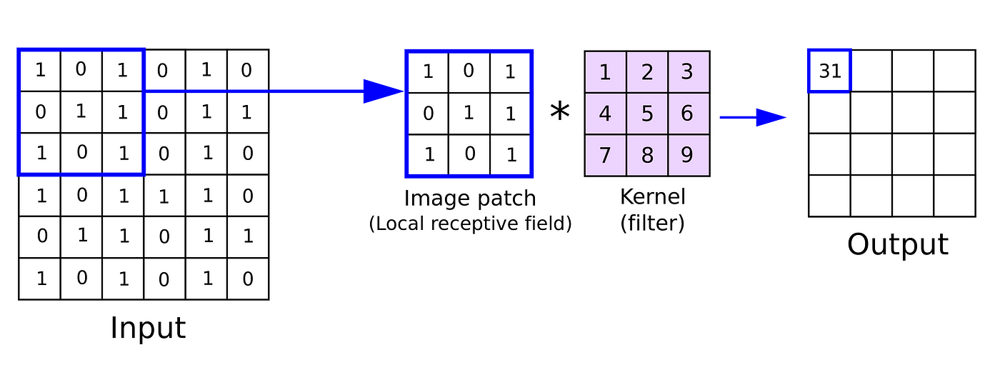

# CNN Image Classification Tutorial

This repository provides a detailed beginner-friendly guide to building and training a Convolutional Neural Network (CNN) for image classification using the CIFAR-10 dataset and a custom dataset stored in the `./data` directory. We explore the fundamentals of CNNs, including convolutional layers, pooling, and fully connected layers, along with PyTorch implementation.



## Table of Contents

1. [Introduction to CNNs](#introduction-to-cnns)
2. [Applications of CNNs](#applications-of-cnns)
3. [Understanding Fully Connected Layers](#understanding-fully-connected-layers)
4. [Installation Guide](#installation-guide)
5. [Hyperparameters](#hyperparameters)
6. [Dataset Structure](#dataset-structure)
7. [Notebook Details
   ](#notebook-details)

---

## Introduction to CNNs

Convolutional Neural Networks (CNNs) are a type of deep learning model specifically designed for image data. CNNs leverage convolutional layers to detect patterns such as edges, textures, and complex shapes in images by using small filters that scan through the input image. This approach helps the network generalize well to spatial data like images.

### How CNN Works

A CNN consists of multiple layers that learn to detect various image features:

1. **Convolutional Layers**: Extract spatial features by applying filters (kernels) over different regions of the image.
2. **Pooling Layers**: Reduce the spatial size of the feature maps, helping reduce computational cost and prevent overfitting.
3. **Fully Connected Layers**: Combine all learned features to make the final classification.

### Explanation of Filters and Kernels

A filter (or kernel) is a small matrix that slides over the input image and performs element-wise multiplication to produce a feature map. Below is an example:


## Applications of CNNs

CNNs are widely used for:

- **Image Classification**: Identifying the category of an object in an image.
- **Object Detection**: Detecting the presence and location of objects within images.
- **Face Recognition**: Identifying individuals in photos or video frames.
- **Medical Imaging**: Analyzing scans like X-rays, MRIs, etc.
- **Autonomous Vehicles**: Assisting in the detection of lanes, pedestrians, and obstacles.

## Understanding Fully Connected Layers

Fully connected layers combine the features detected by previous layers to predict class labels. They "connect" every neuron in one layer to every neuron in the next, creating a dense, multi-dimensional representation that helps in final classification.

---

## Installation Guide

Before running the notebooks, you need to set up your environment.

1. **Install Python Packages**:

   Run the following commands to install the required libraries:

   ```
   pip install torch torchvision matplotlib numpy
   ```

   pip install torch torchvision matplotlib numpy
2. **Verify Installation** :

   ```
   python -c "import torch; import torchvision; print('Setup Complete')" 
   ```

## Hyperparameters

### What Are Hyperparameters?

Hyperparameters are settings that can be tuned before training to control the learning process. Key hyperparameters in CNN training include:

* **Learning Rate** : Controls how quickly the model adjusts during training.
* **Batch Size** : Determines the number of samples per gradient update.
* **Epochs** : The number of times the entire dataset is passed through the network.
* **Number of Filters** : Determines the number of filters in convolutional layers.


## Dataset Structure

For the custom dataset to work correctly, it should follow this structure:

```
./data
├── train
│   ├── class_1
│   │   ├── image1.jpg
│   │   ├── image2.jpg
│   ├── class_2
│       ├── image1.jpg
│       ├── image2.jpg
└── test
    ├── class_1
    │   ├── image1.jpg
    ├── class_2
        ├── image1.jpg
```


## Notebook Details

### Notebook 1: CNN with CIFAR-10

This notebook demonstrates how to train a CNN model on the CIFAR-10 dataset, which is a standard dataset for image classification tasks. It includes:

* **Loading the CIFAR-10 dataset**
* **Defining a CNN model**
* **Training and Evaluating the model**

### Notebook 2: CNN with Custom Dataset

This notebook explains how to load and train a CNN model on a custom dataset stored in `./data`. It includes:

* **Setting up the custom dataset structure**
* **Data augmentation techniques**
* **Model training and evaluation**


## Running the Notebooks

1. Open Jupyter Notebook or JupyterLab.
2. Load and run each cell sequentially in both notebooks to train models on CIFAR-10 and the custom dataset.

---

## Conclusion

This repository provides a foundational understanding of CNNs and their applications in image classification. With hands-on experience, you can now experiment with hyperparameters and modify model architectures to improve classification accuracy.

---

Feel free to reach out if you have any questions or want to contribute!
